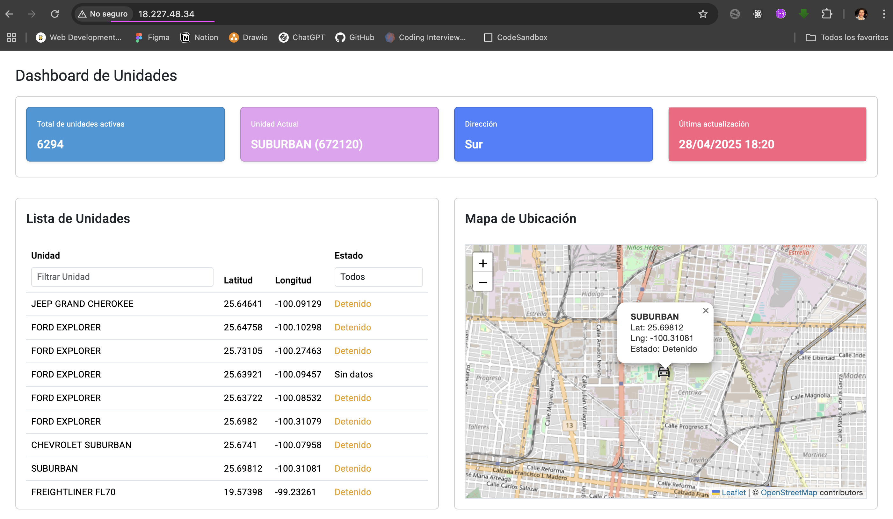

# DashboardApp

Puedes ver la App corriendo en http://18.227.48.34/  usando AWS EC2 y Nginx

Este proyecto se compone de 2 partes: Frontend y Backend

## Frontend
Para correr el proyecto localmente (FrontEnd), sigue estos pasos:
1. Clonar el repositorio
git clone <URL_DEL_REPOSITORIO>
cd dashboard-app

2. Instalar las dependencias
Asegúrate de que tienes Node.js version v20.17.0  y npm instalados. Luego, instala las dependencias del proyecto:
npm install

3. Iniciar el servidor de desarrollo
ng serve

Esto iniciará la aplicación en http://localhost:4200/.

## Backend
Para correr el backend sigue estos pasos:
1. Configurar variables de entorno: 
cd backend
crea un archivo .env en la raíz de la carpeta backend y agrega las configuraciones necesarias:
TELEMATICS_API_KEY={Api_key}
TELEMATICS_API_URL=https://www.telematicsadvance.com/api/v1/

2. Instalar las dependencias
npm install

4. Iniciar el servidor del backend
npm start

5. Verificar el servidor
Server running on port 3000

This project was generated with [Angular CLI](https://github.com/angular/angular-cli) version 17.3.16.

## Development server

Run `ng serve` for a dev server. Navigate to `http://localhost:4200/`. The application will automatically reload if you change any of the source files.

## Code scaffolding

Run `ng generate component component-name` to generate a new component. You can also use `ng generate directive|pipe|service|class|guard|interface|enum|module`.

## Build

Run `ng build` to build the project. The build artifacts will be stored in the `dist/` directory.

## Running unit tests

Run `ng test` to execute the unit tests via [Karma](https://karma-runner.github.io).

## Running end-to-end tests

Run `ng e2e` to execute the end-to-end tests via a platform of your choice. To use this command, you need to first add a package that implements end-to-end testing capabilities.

## Further help

To get more help on the Angular CLI use `ng help` or go check out the [Angular CLI Overview and Command Reference](https://angular.io/cli) page.
